# Cinema tickets

Проект сервиса по покупки билетов в кинотеатр.

## Пример функционирования сервиса.

### 1. Регистрация / Авторизация:

Для работы с сервисом, клиент должен авторизоваться с помощью почты и пароля, указанных при регистрации.

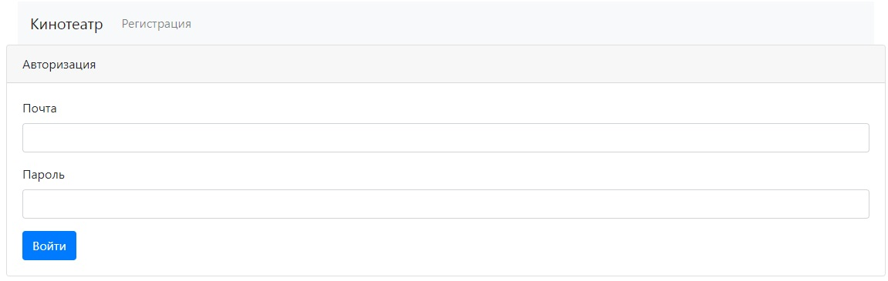

Если это первое посещение, то пользователю необходимо зарегистрироваться. Для этого необходимо перейти на страницу
регистрации в левом верхнем углу страницы.

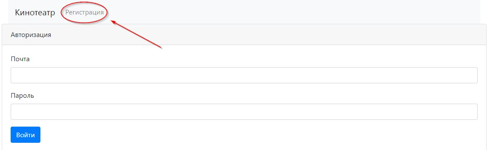

Для регистрации необходимо указать следующие данные заполнив соответствующие поля:

- Имя пользователя;
- Электронную почту;
- Номер телефона;
- Пароль.

После чего нажать кнопку "Зарегистрироваться".

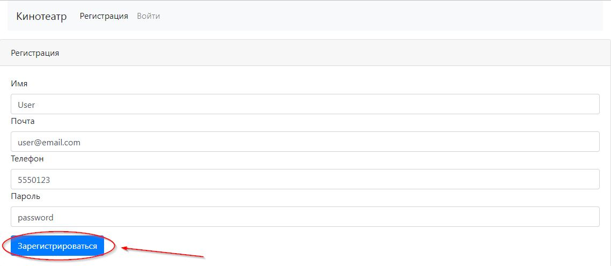

После регистрации пользователь будет перенаправлен на страницу авторизации. Для авторизации необходимо указать
почту и пароль, после чего нажать кнопку "Войти".

Если пользователь с такой почтой уже зарегистрирован, то будет выведено соответствующее сообщение.
Нужно ввести другие данные.

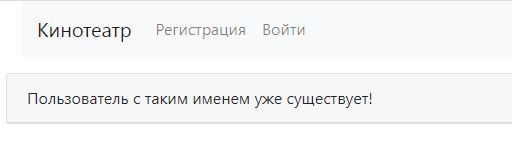

### 2. Бронирование билетов:

После авторизации пользователь перенаправляется на страницу выбора сеансов. Здесь пользователь может выбрать
сеанс, нажав соответствующую кнопку, напротив интересующего сеанса.

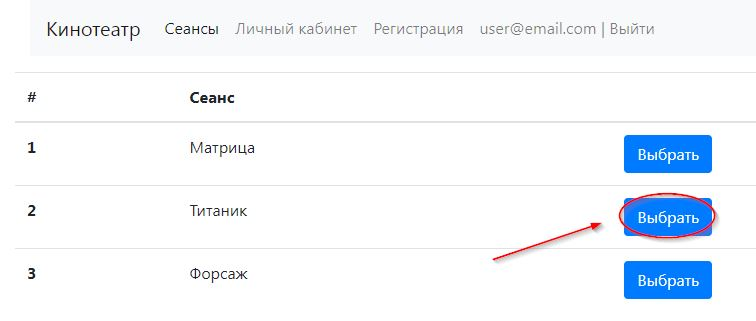

После этого пользователя перенаправит на страницу выбора места. Здесь выводится список всех доступных для 
бронирования мест для данного сеанса. Выбор производится нажатием соответствующей кнопки напротив интересующего места.

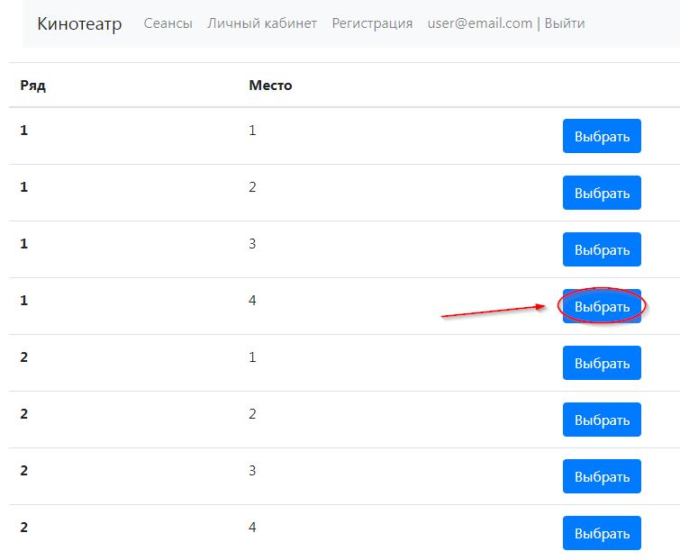

Далее происходит перенаправление на страницу подтверждения. Если пользователя все устраивает, то ему необходимо
нажать на кнопку "Подтвердить".

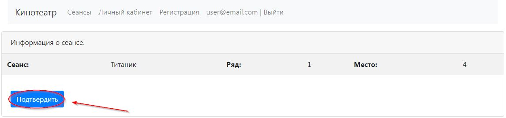

Если все прошло успешно, то пользователь перенаправляется в личный кабинет, в котором указаны его данные 
и информация о всех приобретенных им билетах.

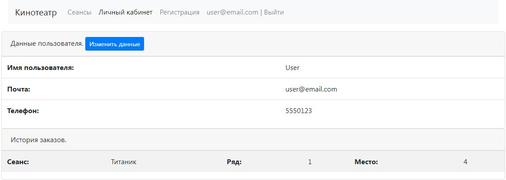

Пользователь может повторить процесс, чтобы приобрести еще билеты.

Может получиться так, что два пользователя одновременно попытаются приобрести одинаковые билеты.
Если такое происходит, то билет приобретет тот, пользователь, который раньше нажмет кнопку "Подтвердить" на странице
подтверждения. Второй пользователь получит сообщение об ошибке, что данные билет уже приобретен и предложение
приобрести другой билет.

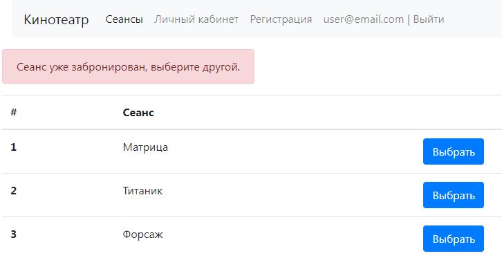

### 3. Личный кабинет.

В личном кабинете указаны данные пользователя, а так же информация о всех приобретенных ранее билетах.
Так же в личном кабинете можно изменить часть данных:

- Имя;
- Телефон.

Для этого необходимо нажать кнопку "Изменить данные"

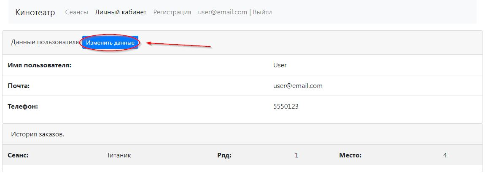

После заполнения соответствующих полей, необходимо нажать кнопку "Сохранить".

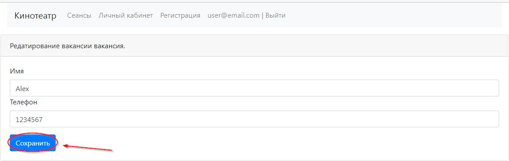

Новая информация сразу же отобразиться в личном кабинете.

