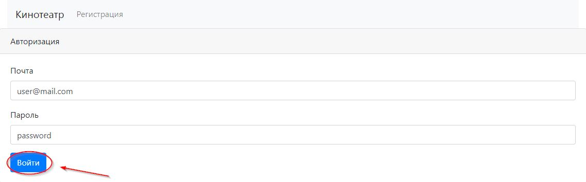

# Проекте - "Кинотеатр"

## Общая информация

Проект разработан с целью улучшения навыков работы с различными стеками технологий и 
представляет собой веб сервис по покупке билетов в кинотеатр. 
При необходимости функционал проекта можно расширить.

## Запуск проекта

Для корректной работы приложения необходимо установить следующие программы:

- Java 16 или выше;
- PostgreSQL 14 или выше;
- Apache Maven 3.8.3 или выше.

1. Настройка postgreSQL. В терминале набрать следующие команды:

- Ввести логин. Вместо username указать свой;
```bash
  psql --username <username>
```
- Ввести пароль;
- Создать базу данных.
```bash
  create database cinema;
```

- Создать таблицы из db/scripts в следующем порядке:
    
    - create_sessions.sql
    - create_users.sql
    - create_tickets.sql
  
2. Запуск при помощи maven. В терминале набрать следующие команды:
```
  mvn spring-boot:run
```

## Пример функционирования сервиса.

### 1. Регистрация / Авторизация:

Для работы с сервисом, клиент должен авторизоваться с помощью почты и пароля, указанных при регистрации.

<details>
  <summary>Пример:</summary>
  
</details>

Если это первое посещение, то пользователю необходимо зарегистрироваться. Для этого необходимо перейти на страницу
регистрации в левом верхнем углу страницы.

<details>
  <summary>Пример:</summary>
  
</details>

Для регистрации необходимо указать следующие данные заполнив соответствующие поля:

- Имя пользователя;
- Электронную почту;
- Номер телефона;
- Пароль.

После чего нажать кнопку "Зарегистрироваться".

<details>
  <summary>Пример:</summary>
  
</details>

После регистрации пользователь будет перенаправлен на страницу авторизации. Для авторизации необходимо указать
почту и пароль, после чего нажать кнопку "Войти".

<details>
  <summary>Пример:</summary>
  
</details>

Если пользователь с такой почтой уже зарегистрирован, то будет выведено соответствующее сообщение.
Нужно ввести другие данные.

<details>
  <summary>Пример:</summary>
  
</details>

### 2. Бронирование билетов:

После авторизации пользователь перенаправляется на страницу выбора сеансов. Здесь пользователь может выбрать
сеанс, нажав соответствующую кнопку, напротив интересующего сеанса.

<details>
  <summary>Пример:</summary>
  
</details>

После этого пользователя перенаправит на страницу выбора места. Здесь выводится список всех доступных для 
бронирования мест для данного сеанса. Выбор производится нажатием соответствующей кнопки напротив интересующего места.

<details>
  <summary>Пример:</summary>
  
</details>

Далее происходит перенаправление на страницу подтверждения. Если пользователя все устраивает, то ему необходимо
нажать на кнопку "Подтвердить".

<details>
  <summary>Пример:</summary>
  
</details>

Если все прошло успешно, то пользователь перенаправляется в личный кабинет, в котором указаны его данные 
и информация о всех приобретенных им билетах.

<details>
  <summary>Пример:</summary>
  
</details>

Пользователь может повторить процесс, чтобы приобрести еще билеты.

Может получиться так, что два пользователя одновременно попытаются приобрести одинаковые билеты.
Если такое происходит, то билет приобретет тот, пользователь, который раньше нажмет кнопку "Подтвердить" на странице
подтверждения. Второй пользователь получит сообщение об ошибке, что данные билет уже приобретен и предложение
приобрести другой билет.

<details>
  <summary>Пример:</summary>
  
</details>

### 3. Личный кабинет.

В личном кабинете указаны данные пользователя, а так же информация о всех приобретенных ранее билетах.
Так же в личном кабинете можно изменить часть данных:

- Имя;
- Телефон.

Для этого необходимо нажать кнопку "Изменить данные"

<details>
  <summary>Пример:</summary>
  
</details>

После заполнения соответствующих полей, необходимо нажать кнопку "Сохранить".

<details>
  <summary>Пример:</summary>
  
</details>

Новая информация сразу же отобразиться в личном кабинете.

## Технологии

[](https://www.java.com/)
[](https://maven.apache.org/)
[](https://spring.io/projects/spring-boot)
[](https://www.postgresql.org/)

[](https://github.com/alxkzncoff/job4j_cinema/actions)
